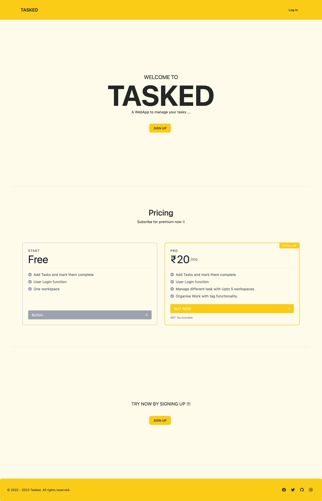

<!-- Improved compatibility of back to top link: See: https://github.com/othneildrew/Best-README-Template/pull/73 -->
<a name="readme-top"></a>

<!-- PROJECT LOGO -->
<br />
<div align="center">
  <a href="https://github.com/MKMukeshkannan/todo-app">
    
  </a>

  <h2 align="center">TASKED</h2>
  <p align="center">
    A WebApp to manage your task
  </p>
    <br />
</div>


<!-- TABLE OF CONTENTS -->
<details>
  <summary>Table of Contents</summary>
  <ol>
    <li>
      <a href="#about-the-project">About The Project</a>
      <ul>
        <li><a href="#built-with">Built With</a></li>
      </ul>
    </li>
    <li>
      <a href="#getting-started">Getting Started</a>
      <ul>
        <li><a href="#prerequisites">Prerequisites</a></li>
        <li><a href="#installation">Installation</a></li>
      </ul>
    </li>
    <li><a href="#usage">Usage</a></li>
    <li><a href="#contact">Contact</a></li>
  </ol>
</details>


<!-- ABOUT THE PROJECT -->
## About The Project
Taked is a to-do WebApp used to manage tasks efficiently. This app includes a user login function that allows users to manage their tasks on any device they want. They can delete tasks that are not needed or strike tasks that are done. 

<p align="right">(<a href="#readme-top">back to top</a>)</p>


### Built With
I used the following frameworks/tools to build this project:

* [![Django][Django]][Django-url]
* [![Tailwind][Tailwindcss]][Tailwindcss-url]
* [![SQLite][SQLite]][SQLite-url]


<p align="right">(<a href="#readme-top">back to top</a>)</p>


<!-- GETTING STARTED -->
## Getting Started
Instruction to clone this reporsitory and setting it locally on your machine.

### Prerequisites

Django is a python based Web-Framework, so you will need python to use this project, 
* ON MAC
  ```sh
  brew install python
  ```
* ON LINUX
   ```sh
   sudo apt get python
   ````
* ON WINDOWS - install it from offical website

### Installation

_Follow the steps given below to clone, install and set up the project on your machine_

1. Clone the repo
   ```sh
   git clone https://github.com/MKMukeshkannan/todo-app
   ```
2. Go to that directory 
   ```sh
   cd todo-app
   ```
3. Create a virtual environment
   ```sh
   pip install virtualenv
   ```
     ON WINDOWS
    ```sh
     virtualenv env
     env\Scripts\activate
     ```
     ON MAC
     ```sh
     virtualenv env
     source env/bin/activate
     ```
4. Install dependencies
   ```sh
   pip install -r requirments.txt
   ```
5. Make Migrations  
   ```sh
   python manage.py makemigrations
   ```
   ```sh
   python manage.py migrate
   ```
 6. Create a super user to login
    ```sh
    python manage.py createsuperuser 
    ```
  and enter username and password
  
 7. Now Runserver to use,
    ```sh
    python manage.py runserver
    ```
  
<p align="right">(<a href="#readme-top">back to top</a>)</p>


<!-- USAGE EXAMPLES -->
## Usage

User need to log-in to gain access to their dashboard. New users can create an account by signning up.
User can type their task in the feild given and click on the add button to add the task into the space below.
They can strike out tasks that are done by clicking on the dash icon (-)
or delete the tasks by clicking on the cross ( x )

<p align="right">(<a href="#readme-top">back to top</a>)</p>


<!-- CONTACT -->
## Contact

M K Mukesh Kannan - [@mukesh-kannan](https://www.linkedin.com/in/mukesh-kannan-mk/) - mukeshkannan311@gmail.com

Project Link: [TODO](https://github.com/MKMukeshkannan/todo-app)

<p align="right">(<a href="#readme-top">back to top</a>)</p>


<!-- SCREENSHOTs -->
## Screenshot of the project

<h3>HOME PAGE</h3>


<h3>LOGIN PAGE</h3>


<h3>SIGNUP PAGE</h3>


<h3>TODO PAGE</h3>


<p align="right">(<a href="#readme-top">back to top</a>)</p>


[Django]: https://img.shields.io/badge/Django-20232A?style=for-the-badge&logo=Django&logoColor=#092E20
[Django-url]: https://www.djangoproject.com/
[Tailwindcss]: https://img.shields.io/badge/Tailwind-35495E?style=for-the-badge&logo=tailwindcss&logoColor=#06B6D4
[Tailwindcss-url]: https://tailwindcss.com/
[SQLite]: https://img.shields.io/badge/SQLite-E4637C?style=for-the-badge&logo=SQLite&logoColor=#003B57
[SQLite-url]: https://sqlite.org/index.html
